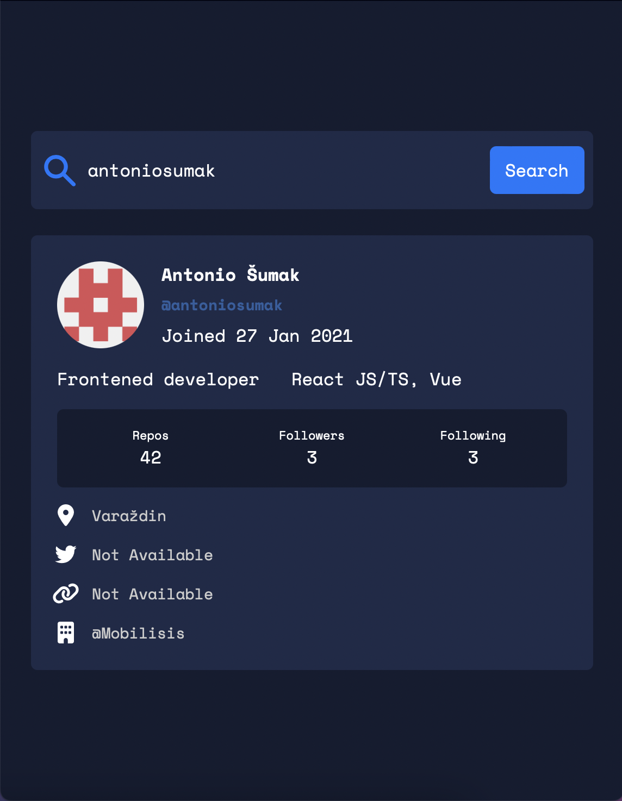
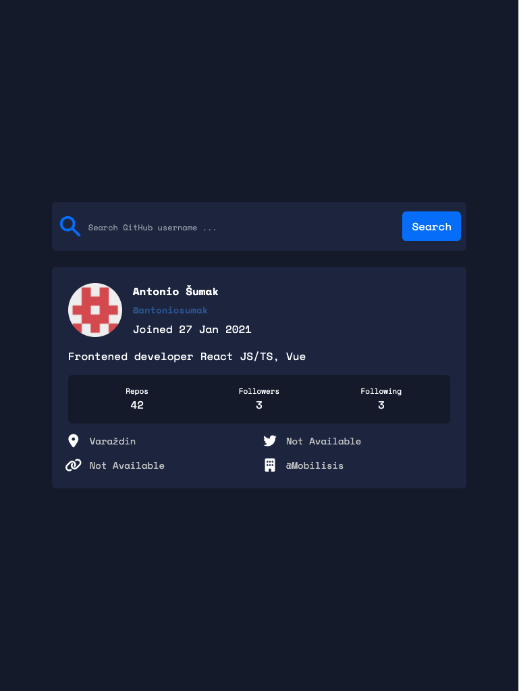
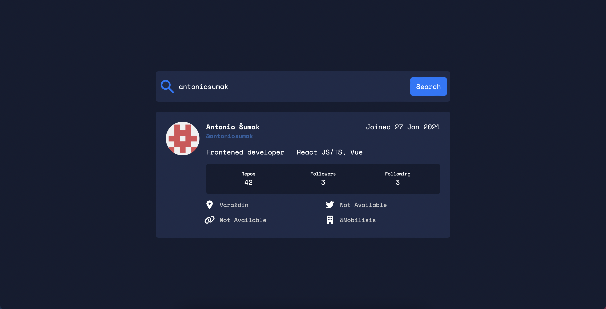

## Installation

Clone repository, position yourself into root folder

```
cd github-username-api
```

Install all dependencies

```
npm install
```

Run application

```
npm run dev
```

## App views

### Mobile

 

### Tablet

 

 ### Desktop 
 
